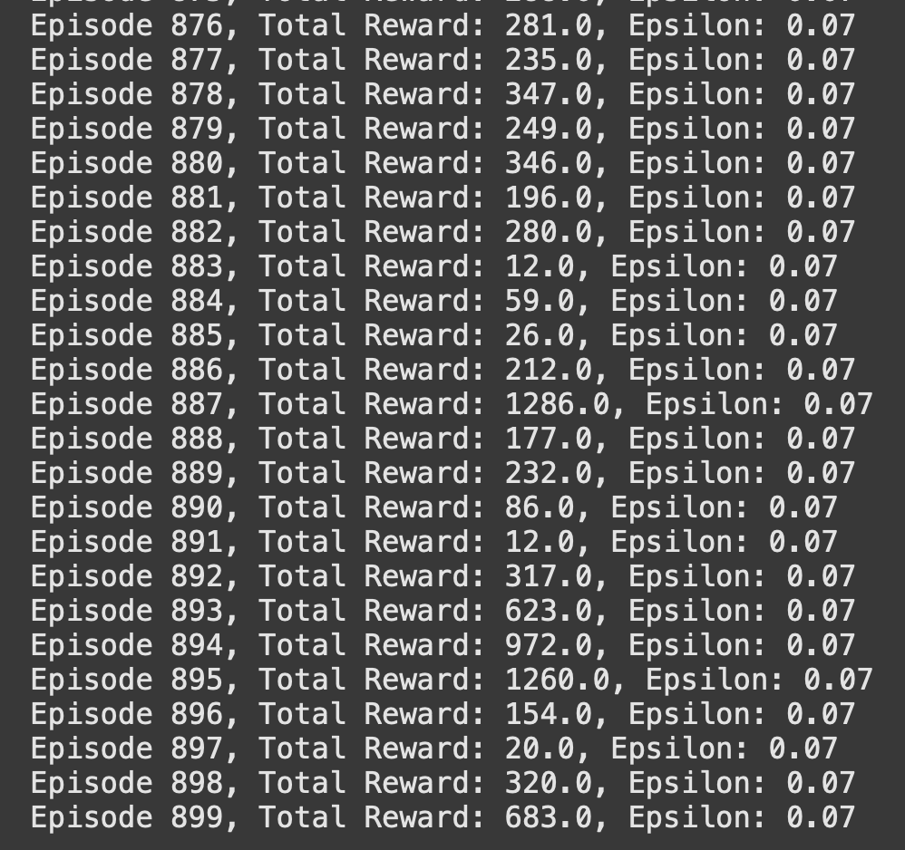

# Deep Q-Network (DQN) — CartPole-v1 (PyTorch from Scratch)

This repository contains a from-scratch implementation of the **Deep Q-Network (DQN)** algorithm in PyTorch.  
It trains an agent on the **CartPole-v1** environment from Gymnasium, using experience replay, a target network, and ε-greedy exploration.  

---

## Key Features
- Implemented fully from scratch in PyTorch
- Experience Replay to break correlation in training samples
- Target Network for stable bootstrapping
- ε-Greedy Exploration with decay
- Automatic recording of demo MP4 videos

---
## Training Results
Example reward curve during training:
Demo video of trained agent is inside `runs/`.


Example reward results during training:


---

## Quickstart
```bash
pip install torch gymnasium numpy tqdm imageio imageio-ffmpeg
python dqn.py
